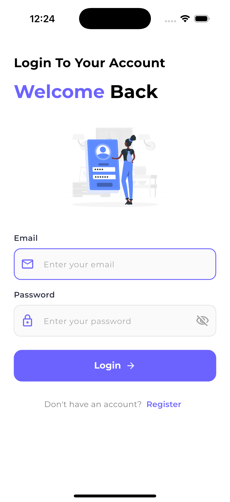
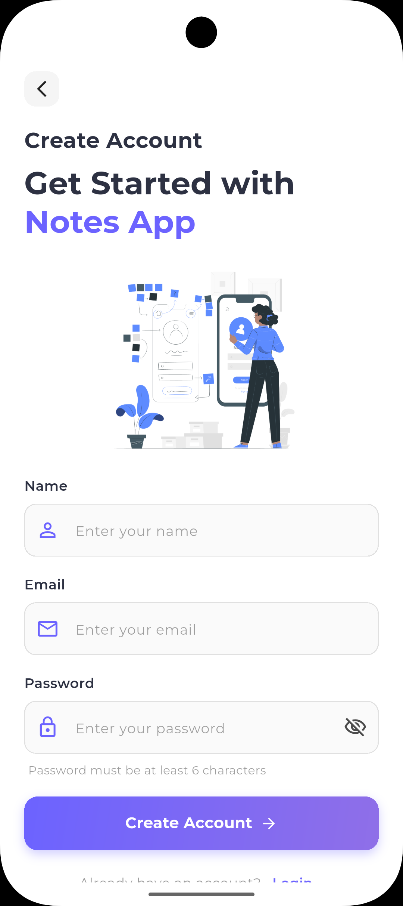
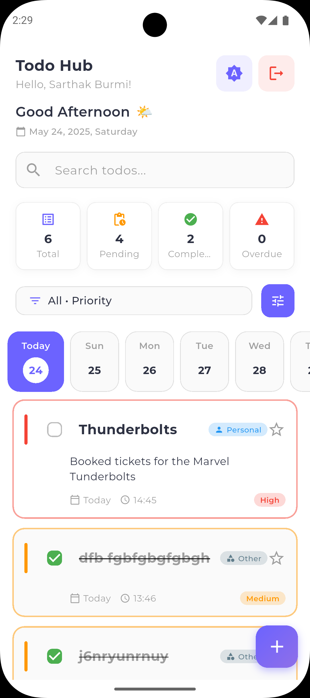
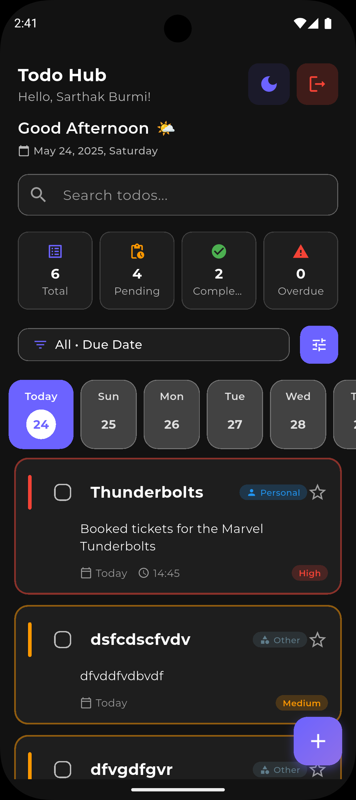
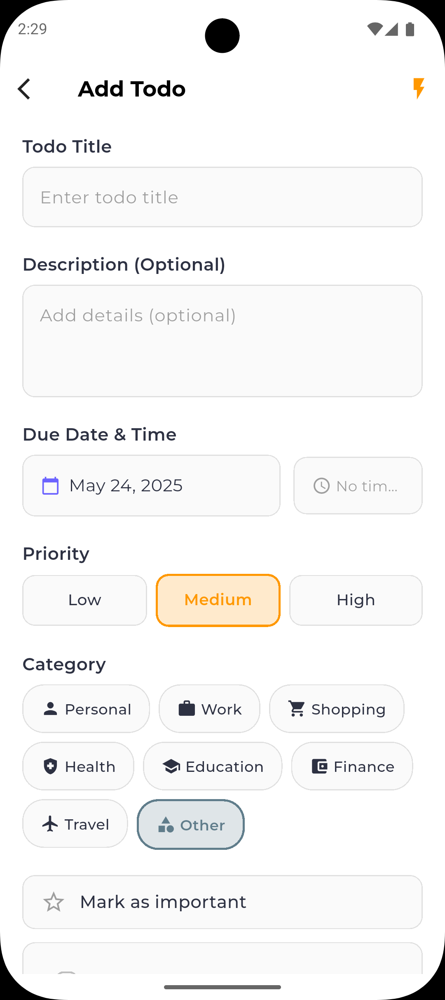
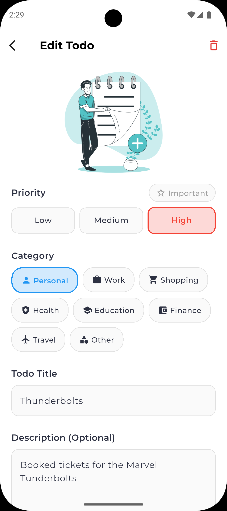
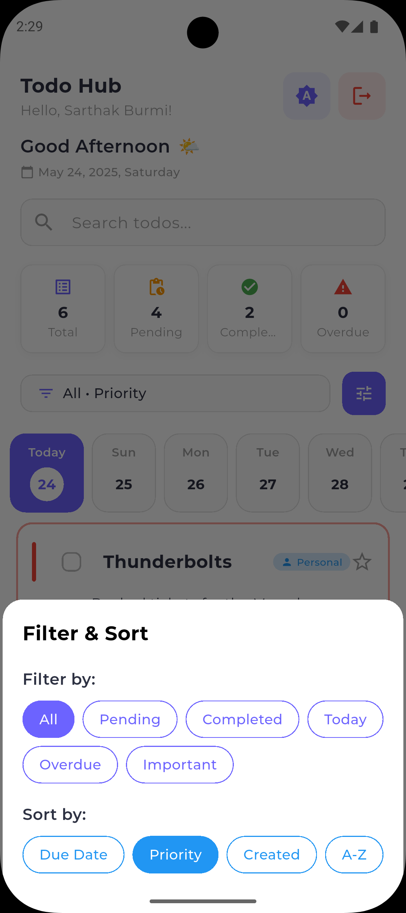
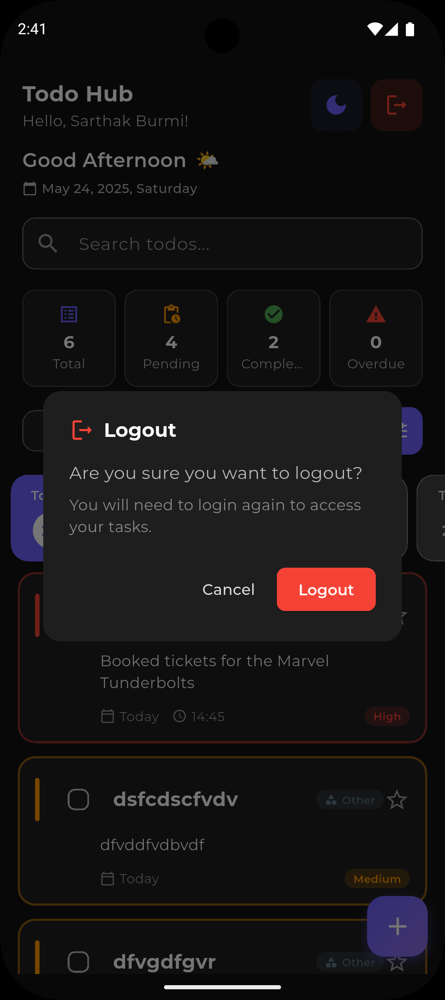

TodoHub - Enhanced Flutter Todo Management App
==============================================

🚀 Overview
-----------

TodoHub is a feature-rich, modern todo management application built with Flutter and Supabase. It combines beautiful design with powerful functionality, offering priority management, category organization, smart filtering, and real-time synchronization across devices.

✨ Features
----------

### 🔐 Authentication

*   **Secure Login/Signup** - Email/password authentication with validation
    
*   **Persistent Sessions** - Stay logged in across app restarts
    
*   **User Profiles** - Customizable display names and preferences
    
*   **Robust Logout** - Safe session management with error handling
    

### 📝 Advanced Todo Management

*   **Smart Todo Creation** - Quick mode for rapid entry or detailed mode
    
*   **Priority System** - High (Red), Medium (Orange), Low (Green) with visual indicators
    
*   **Category Organization** - 8 predefined categories with icons (Work, Personal, Shopping, Health, etc.)
    
*   **Due Dates & Times** - Set specific deadlines with optional time constraints
    
*   **Important Todos** - Star system for urgent items
    
*   **Completion Tracking** - Mark todos as done with visual feedback
    

### 🔍 Smart Filtering & Organization

*   **Advanced Filters** - All, Pending, Completed, Today, Overdue, Important
    
*   **Multiple Sorting** - By due date, priority, creation date, or alphabetical
    
*   **Search Functionality** - Find todos instantly by title or description
    
*   **Date Navigation** - Quick date selector for daily organization
    
*   **Statistics Dashboard** - Real-time progress tracking and analytics
    

### 🎨 Modern UI/UX

*   **Responsive Design** - Perfect on phones, tablets, and different screen sizes
    
*   **Smooth Animations** - Staggered list animations and smooth transitions
    
*   **Swipe Actions** - Edit and delete with intuitive gestures
    
*   **Visual Priority** - Color-coded borders and priority chips
    
*   **Category Icons** - Instant visual recognition with themed colors
    
*   **Overdue Alerts** - Red highlighting for missed deadlines
    

### 🌓 Theming System

*   **Triple Theme Support** - Light, Dark, and System auto-detection
    
*   **Consistent Design** - Material Design 3 principles throughout
    
*   **Theme Persistence** - Remembers your preference across sessions
    
*   **Dynamic Colors** - Adaptive color schemes for better accessibility
    

📱 Screenshots
--------------

🛠️ Technology Stack
--------------------

*   **Framework**: Flutter 3.3+ with Dart
    
*   **State Management**: Riverpod (Latest)
    
*   **Backend**: Supabase (Authentication, Database, Real-time)
    
*   **UI/UX**: Material Design 3, Google Fonts, Custom Animations
    
*   **Database**: PostgreSQL (via Supabase)
    
*   **Features**: Flutter Staggered Animations, Flutter Slidable
    
*   **Storage**: SharedPreferences for local settings
    

🚀 Getting Started
------------------

### Prerequisites

*   Flutter SDK 3.3.3 or higher
    
*   Dart SDK (latest stable)
    
*   Supabase account and project
    
*   Android Studio / VS Code with Flutter extensions
    

### 📥 Installation

1.  bashgit clone [https://github.com/sarthak-burmi/notes-application\_flutter](https://github.com/sarthak-burmi/notes-application_flutter)
    
2.  bashflutter pub get
    
3.  **Configure Supabase:**
    
    *   Create a new Supabase project
        
    *   Update credentials in lib/core/supabase\_client\_sample.dart
        
    *   Run the provided SQL schema to create enhanced tables
        
4.  sql-- Run the enhanced schema from our database\_schema\_update.sql
    
5.  bashflutter run
    

🔧 Configuration
----------------

### Supabase Setup

1.  Create tables using the enhanced schema
    
2.  Enable Row Level Security (RLS)
    
3.  Set up authentication policies
    
4.  Configure real-time subscriptions
    

🎯 Key Enhancements Over Basic Task App
---------------------------------------

*   ⭐ **Priority Management** - Visual priority system with color coding
    
*   📁 **Category Organization** - 8 predefined categories with icons
    
*   🔍 **Advanced Filtering** - Multiple filter and sort options
    
*   ⏰ **Time Management** - Due dates with optional specific times
    
*   📊 **Statistics Dashboard** - Real-time progress tracking
    
*   🎨 **Enhanced UI** - Modern Material Design 3 implementation
    
*   📱 **Responsive Design** - Perfect across all device sizes
    
*   🚀 **Performance** - Optimized database queries and caching
    

🤝 Contributing
---------------

1.  Fork the repository
    
2.  Create your feature branch (git checkout -b feature/AmazingFeature)
    
3.  Commit your changes (git commit -m 'Add some AmazingFeature')
    
4.  Push to the branch (git push origin feature/AmazingFeature)
    
5.  Open a Pull Request
    

📄 License
----------

This project is licensed under the MIT License - see the [LICENSE](LICENSE) file for details.

🙏 Acknowledgements
-------------------

*   [Flutter Team](https://flutter.dev/) - Amazing cross-platform framework
    
*   [Riverpod](https://riverpod.dev/) - Powerful state management
    
*   [Supabase](https://supabase.io/) - Backend-as-a-Service platform
    
*   [Material Design](https://material.io/) - Design system guidelines
    
*   [Google Fonts](https://fonts.google.com/) - Typography
    
*   [Flutter Community](https://flutter.dev/community) - Packages and support
    

Made with ❤️ using Flutter

[⬆️ Back to Top](#todohub---enhanced-flutter-todo-management-app)