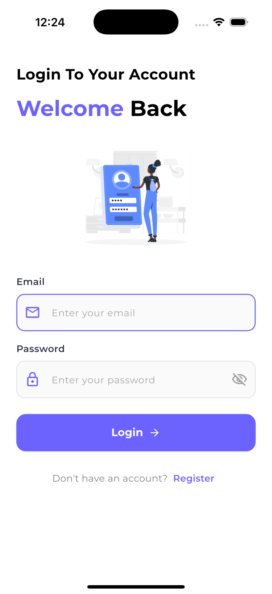
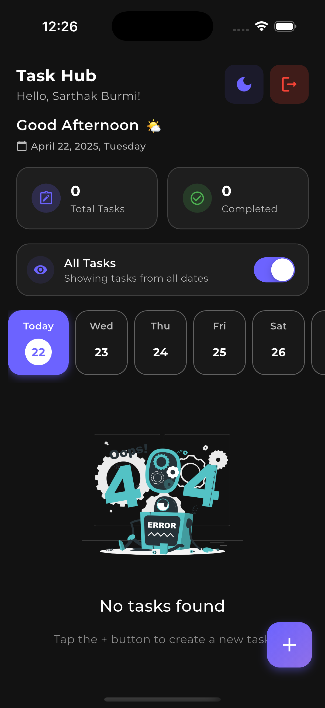
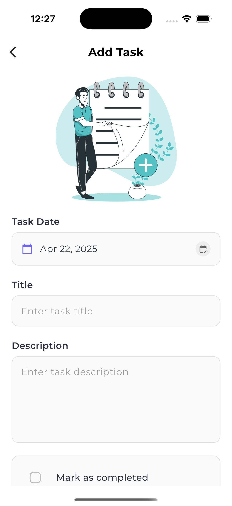
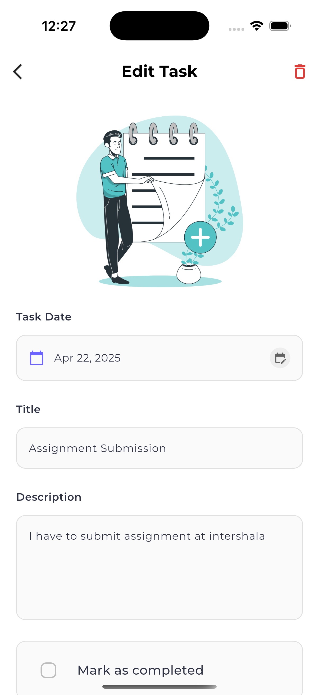

# TaskHub - Flutter Task Management App

<div align="center">
  
</div>

## Overview

TaskHub is a modern, responsive task management application built with Flutter and Supabase. It features a clean, intuitive UI with both light and dark themes, user authentication, and real-time task synchronization.

## Features

### Authentication

- Email/password sign-up and login
- Persistent login sessions
- User profile with customizable name

### Task Management

- Create, edit, and delete tasks
- Mark tasks as completed
- Set due dates for tasks
- Filter tasks by date
- View all tasks or filter by selected date

### UI/UX

- Smooth animations and transitions
- Swipe actions for task management
- Date selector for quick navigation

### Theming

- Light and dark theme support
- System theme detection
- Manual theme switching with persistent selection

## Screenshots

<div align="center">
  <div style="display: flex; flex-direction: row;">
    
    
    
     
    
  </div>
</div>

## Technology Stack

- **Framework**: Flutter
- **State Management**: Riverpod
- **Backend**: Supabase (Authentication, Database)
- **Styling**: Google Fonts, Custom Themes
- **Animations**: Flutter Staggered Animations
- **UI Components**: Flutter Slidable, Custom Cards

## Project Structure

```
lib/
├── authentication/
│   ├── Login.dart
│   └── CreateAccount.dart
├── constants/
│   ├── colors.dart
│   ├── appTheme.dart
│   └── timeGreeting.dart
├── core/
│   └── supaBase_client.dart
├── model/
│   └── TaskModel.dart
├── provider/
│   ├── auth_provider.dart
│   └── task_provider.dart
├── screens/
│   ├── add_task.dart
│   ├── task_edit.dart
│   └── task_list.dart
└── main.dart
```

## Getting Started

### Prerequisites

- Flutter SDK (latest version recommended)
- Dart SDK
- Supabase account and project

### Installation

1. Clone the repository:

   ```
   git clone https://github.com/yourusername/taskhub.git
   ```

2. Navigate to the project directory and install dependencies:

   ```
   cd taskhub
   flutter pub get
   ```

3. Configure Supabase:

   - Create a Supabase project
   - Update the Supabase URL and anon key in `lib/core/supabase_client_sample.dart`
   - Set up the required tables in Supabase:
     - `users` table with `id`, `email`, and `name` fields
     - `notes` table with `id`, `title`, `content`, `owner_id`, `is_completed`, `created_at`, `updated_at`, and `task_date` fields

4. Run the application:
   ```
   flutter run
   ```

## Database Schema

### Users Table

| Column | Type      |
| ------ | --------- |
| id     | UUID (PK) |
| email  | String    |
| name   | String    |

### Notes Table

| Column       | Type                 |
| ------------ | -------------------- |
| id           | UUID (PK)            |
| title        | String               |
| content      | String               |
| owner_id     | UUID (FK → users.id) |
| is_completed | Boolean              |
| created_at   | Timestamp            |
| updated_at   | Timestamp            |
| task_date    | Timestamp            |

## Acknowledgements

- [Flutter](https://flutter.dev)
- [Riverpod](https://riverpod.dev)
- [Supabase](https://supabase.io)
- [Google Fonts](https://fonts.google.com)
- [Flutter Staggered Animations](https://pub.dev/packages/flutter_staggered_animations)
- [Flutter Slidable](https://pub.dev/packages/flutter_slidable)
